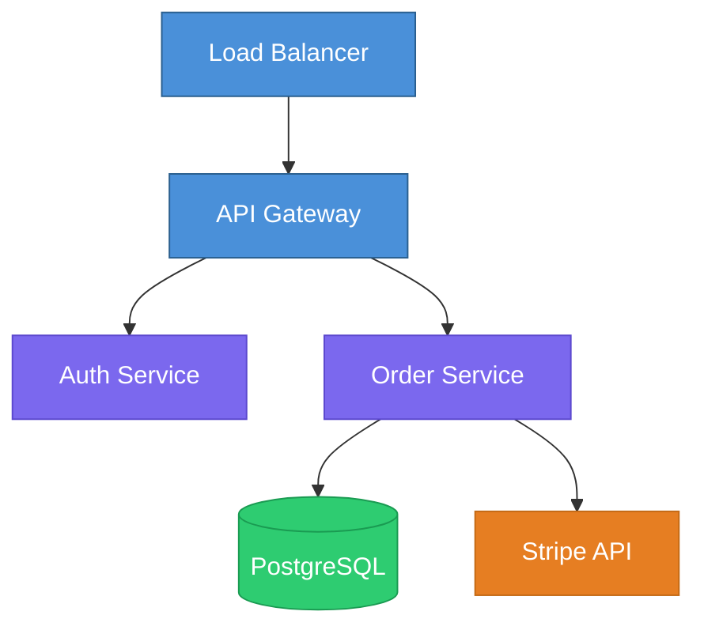
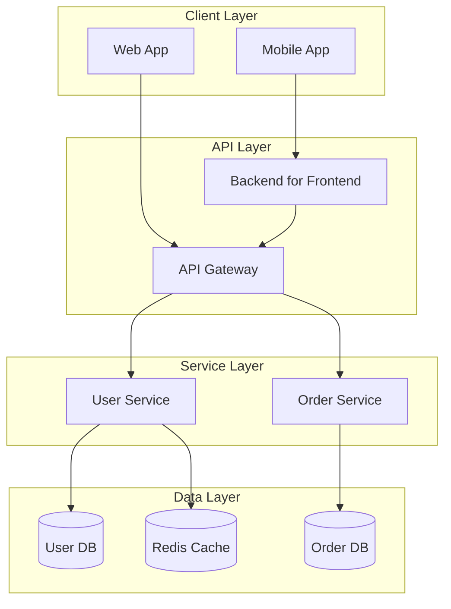

# Mermaid Diagrams

## Purpose

Provide diagram type selection guidance, Mermaid syntax knowledge, and visual conventions for generating accurate, readable diagrams. Apply these standards when creating architecture diagrams, flowcharts, sequence diagrams, entity-relationship diagrams, class diagrams, state machines, or any other Mermaid-supported visualization.

## Diagram Type Selection

Choose the diagram type based on what needs to be communicated. Use the following table to match the user's goal to the appropriate diagram type.

| Goal | Diagram Type | Mermaid Keyword | Best For |
|------|-------------|-----------------|----------|
| Show how components connect | Flowchart / Graph | `graph` or `flowchart` | System architecture, service dependencies, data pipelines |
| Show message flow over time | Sequence Diagram | `sequenceDiagram` | API call chains, authentication flows, microservice communication |
| Model database structure | ER Diagram | `erDiagram` | Database schemas, data models, entity relationships |
| Show class structure and inheritance | Class Diagram | `classDiagram` | Object-oriented design, interface hierarchies, module APIs |
| Model state transitions | State Diagram | `stateDiagram-v2` | Order lifecycles, UI states, workflow engines, FSMs |
| Show a timeline of work | Gantt Chart | `gantt` | Project schedules, migration timelines, sprint plans |
| Show Git branching | Git Graph | `gitGraph` | Branching strategies, release flows, merge patterns |
| Visualize user journeys | User Journey | `journey` | UX flows, customer experience mapping |

When the goal is ambiguous, prefer flowchart/graph diagrams as the default -- they are the most flexible and widely understood.

## Graph Direction

Select graph direction based on the content structure and reading flow.

| Direction | Code | Use When |
|-----------|------|----------|
| Top to Bottom | `TB` or `TD` | Hierarchies, org charts, inheritance trees, call stacks |
| Left to Right | `LR` | Pipelines, data flows, sequential processes, timelines |
| Bottom to Top | `BT` | Dependency trees where leaves are at the top |
| Right to Left | `RL` | Reverse flows, rarely needed |

Default to `TB` for architecture diagrams and `LR` for sequential workflows. Choose the direction that minimizes arrow crossings and produces the most compact layout.

## Color Coding Conventions

Apply consistent colors by component type to make diagrams scannable at a glance. Use Mermaid `style` directives or `classDef` definitions.

| Component Type | Fill Color | Stroke Color | Text Color | Purpose |
|---------------|-----------|-------------|-----------|---------|
| User-facing / Entry point | `#4A90D9` (blue) | `#2A5F8F` | `#FFFFFF` | API gateways, frontends, client apps |
| Core service / Business logic | `#7B68EE` (purple) | `#5B48CE` | `#FFFFFF` | Application servers, domain services |
| Data store | `#2ECC71` (green) | `#1A9B52` | `#FFFFFF` | Databases, caches, file storage |
| External service | `#E67E22` (orange) | `#C46A15` | `#FFFFFF` | Third-party APIs, SaaS integrations |
| Message broker / Queue | `#F39C12` (yellow) | `#D4850A` | `#000000` | Kafka, RabbitMQ, SQS, event buses |
| Monitoring / Observability | `#95A5A6` (gray) | `#7F8C8D` | `#FFFFFF` | Logging, metrics, alerting |
| Error / Warning state | `#E74C3C` (red) | `#C0392B` | `#FFFFFF` | Failed states, error paths, alerts |

Apply these via `classDef` for reusability:



Override these defaults only when a project has its own established color palette. In that case, match the project's conventions.

## Subgraph Organization

Use subgraphs to group related components and clarify system boundaries. Follow these guidelines:

- **Group by deployment boundary** -- place components that deploy together in the same subgraph (e.g., "Kubernetes Cluster", "AWS VPC", "Client Browser")
- **Group by domain** -- in domain-driven designs, group by bounded context (e.g., "Billing", "Inventory", "Shipping")
- **Limit nesting depth** -- keep subgraph nesting to a maximum of 2 levels; deeper nesting reduces readability
- **Label subgraphs descriptively** -- use clear boundary names, not generic labels like "Group 1"



## Label and Annotation Strategy

### Node Labels

Keep node labels short and descriptive. Aim for 2-4 words that identify the component. Avoid including implementation details, version numbers, or technology stack in the node label itself -- place those in annotations or a legend.

| Effective Label | Ineffective Label | Why |
|----------------|-------------------|-----|
| `Auth Service` | `Spring Boot Auth Microservice v2.3` | Too specific; implementation details change |
| `Order DB` | `PostgreSQL 15.2 Primary RDS Instance` | Infrastructure details belong elsewhere |
| `Payment Gateway` | `Stripe/PayPal Payment Processing Layer` | List specific providers in notes, not labels |
| `Message Queue` | `Queue` | Too vague; add domain context |

### Edge Labels

Add labels to edges only when the relationship is not obvious from the connected nodes. Over-labeling creates visual clutter; under-labeling creates ambiguity.

Always label edges in these cases:
- Multiple edges between the same pair of nodes (distinguish each connection)
- Protocol or transport differences (HTTP vs gRPC vs WebSocket)
- Data payloads that are not obvious (e.g., `|order events|` on a queue connection)
- Conditional or async connections (e.g., `|on failure|`, `|async|`)

Omit labels when:
- The relationship is clear from the node names (e.g., `API Gateway --> Auth Service` needs no label)
- Every edge would have the same label (e.g., all edges are HTTP -- state that in a note instead)

### Notes and Comments

Use Mermaid comments (`%%`) to document assumptions, scope boundaries, and update dates in the diagram source. These comments are invisible in the rendered output but help future maintainers understand the diagram's intent.

```
%% Scope: Order processing subsystem only
%% Last verified against production: 2025-Q4
%% Owner: Platform Engineering team
```

For visible annotations in sequence diagrams and state diagrams, use `Note` syntax to highlight important constraints, SLAs, or business rules that affect the depicted flow.

## Diagram Composition for Large Systems

### Multi-Level Approach

Represent complex architectures as a hierarchy of diagrams rather than a single monolithic view:

1. **Level 0 -- System Context** -- show the system as a single box with external actors and systems around it (5-8 nodes maximum)
2. **Level 1 -- Container View** -- expand the system into its major containers: web apps, APIs, databases, message brokers (10-15 nodes)
3. **Level 2 -- Component View** -- zoom into a single container to show its internal components and their interactions (10-15 nodes per container)

Each level references the next by name, allowing readers to drill down without being overwhelmed.

### Cross-Referencing Between Diagrams

When splitting a system across multiple diagrams, maintain traceability:

- Use the same node IDs and labels for components that appear in multiple diagrams
- Add a comment at the top of each diagram indicating which level and scope it covers
- Include a "See Also" reference to related diagrams in the diagram source comments

## Best Practices

### Readability

- Keep node labels concise -- 2-4 words maximum per node
- Use consistent node ID naming conventions (PascalCase or camelCase, not mixed)
- Limit diagrams to 15-20 nodes; split larger systems into multiple focused diagrams
- Add link labels only when the relationship type is not obvious from context
- Place the most important flow path as the primary vertical or horizontal axis

### Accuracy

- Verify every connection in the diagram against actual code, configuration, or architecture documentation
- Include directionality on all arrows -- undirected edges in directed systems cause confusion
- Label async connections explicitly (e.g., "async", "event", "webhook") to distinguish them from synchronous calls
- Represent optional or conditional paths with dotted lines (`-.->` syntax)

### Maintainability

- Define reusable styles with `classDef` rather than inline `style` on individual nodes
- Use meaningful node IDs that reflect the component name, making future edits easier
- Add a title comment at the top of the diagram source (`%% System Architecture -- Order Processing`)
- Keep Mermaid source formatted with one relationship per line for clean diffs in version control

### Common Mistakes to Avoid

- Do not create diagrams with circular dependencies unless the system genuinely has them -- most cycles indicate a modeling error
- Do not mix abstraction levels in a single diagram (e.g., showing both "AWS Region" and "validateEmail() function" in the same view)
- Do not use diagram types for purposes they were not designed for (e.g., do not use a sequence diagram to show static architecture)
- Do not omit the diagram direction declaration -- always specify `TB`, `LR`, or the appropriate direction explicitly

## Additional Resources

### Reference Files

For complete Mermaid syntax reference, node shapes, arrow types, and ready-to-use patterns for every diagram type, consult:
- **`references/diagram-patterns.md`** -- Node shapes, arrow types, and annotated patterns for flowcharts, sequence diagrams, ER diagrams, class diagrams, state machines, and styling techniques
