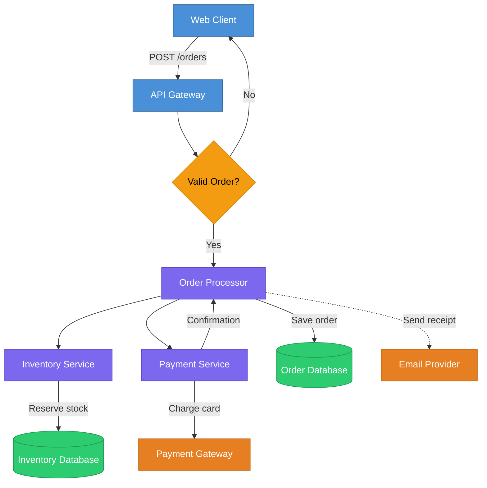
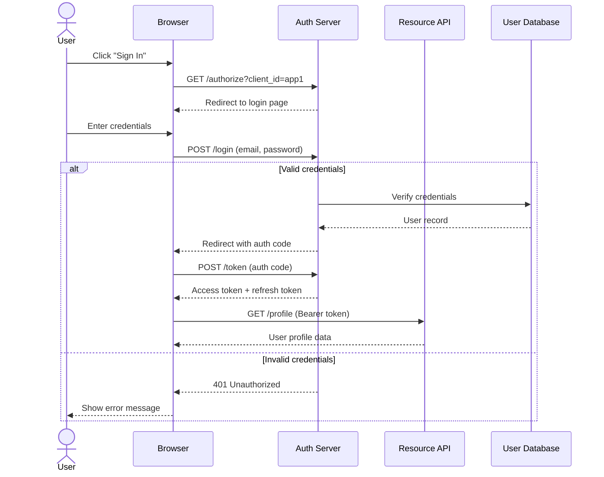
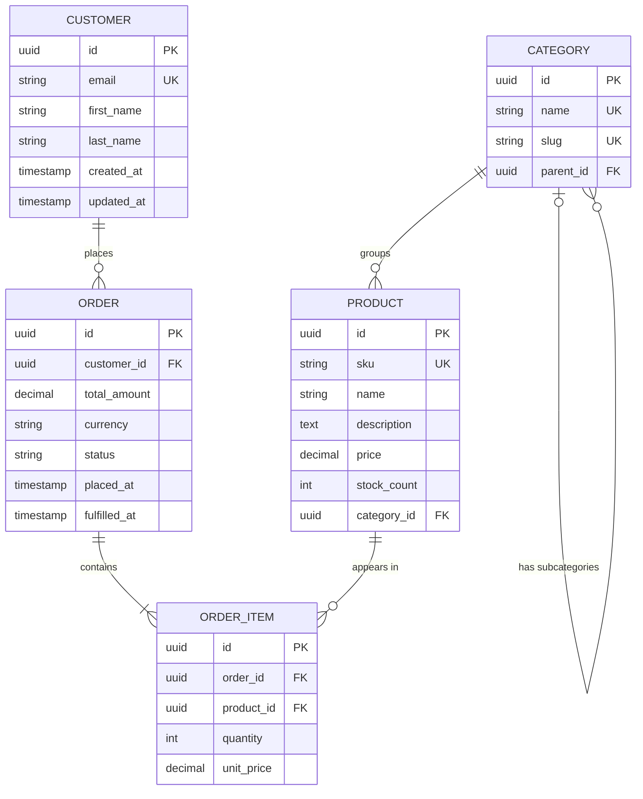
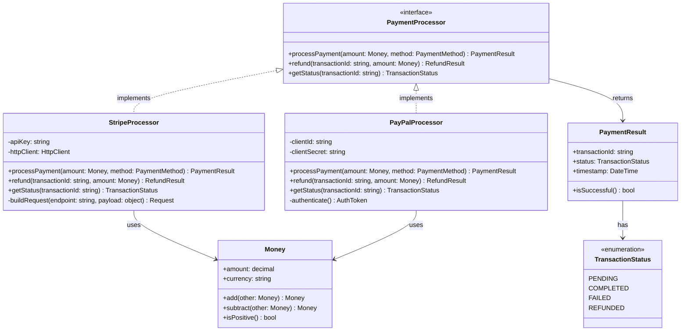
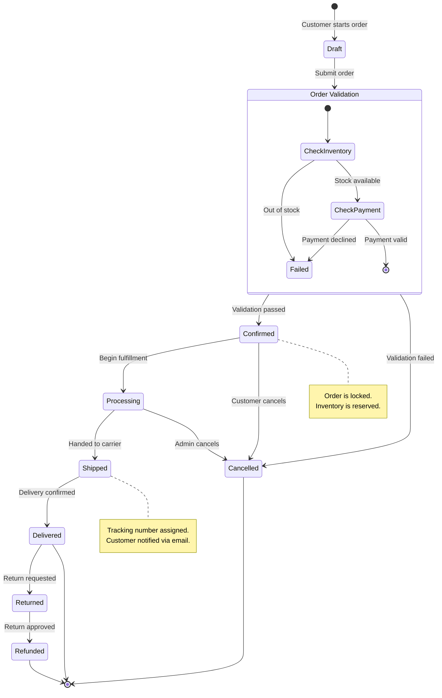
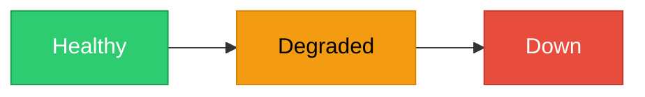
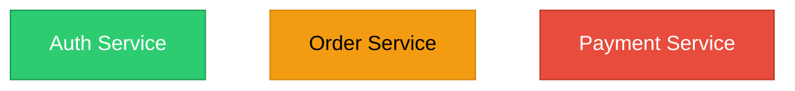

# Mermaid Diagram Patterns Reference

Complete syntax reference and reusable patterns for all supported Mermaid diagram types.

## Node Shape Reference

Use node shapes to convey the type of component at a glance.

| Shape | Syntax | Use For |
|-------|--------|---------|
| Rectangle | `A[Label]` | Generic process, service, application |
| Rounded rectangle | `A(Label)` | Start/end points, user actions |
| Stadium / Pill | `A([Label])` | Terminal events, triggers |
| Cylinder | `A[(Label)]` | Databases, persistent storage |
| Circle | `A((Label))` | Connection points, junctions |
| Diamond / Rhombus | `A{Label}` | Decision points, conditionals |
| Hexagon | `A{{Label}}` | Preparation steps, configuration |
| Parallelogram | `A[/Label/]` | Input/output operations |
| Trapezoid | `A[/Label\]` | Manual operations |
| Double circle | `A(((Label)))` | External endpoints, events |
| Subroutine | `A[[Label]]` | Predefined process, library call |
| Asymmetric | `A>Label]` | Flags, signals, off-page connectors |

## Arrow Type Reference

Use arrow styles to communicate the nature of connections.

| Arrow | Syntax | Meaning |
|-------|--------|---------|
| Solid arrow | `-->` | Synchronous call, direct dependency |
| Dotted arrow | `-.->` | Asynchronous call, optional path |
| Thick arrow | `==>` | Primary data flow, critical path |
| Solid with label | `-->\|label\|` | Labeled synchronous connection |
| Dotted with label | `-.->\|label\|` | Labeled async connection |
| Thick with label | `==>\|label\|` | Labeled critical path |
| No arrowhead | `---` | Undirected association |
| Dotted no arrowhead | `-.-` | Weak association |
| Bidirectional | `<-->` | Two-way communication |

Longer dashes add length to arrows for layout control: `---->` is longer than `-->`.

## Flowchart / Graph Diagram

The most versatile diagram type. Use for architecture overviews, data flows, decision trees, and process maps.

### Pattern



### Key Syntax Notes

- Declare `classDef` styles before node definitions for clean organization
- Apply classes with `:::className` suffix on the node declaration
- Use `|label|` on arrows to annotate the relationship
- Use `-.->` for async or optional connections (e.g., sending email)
- Add `%%` comments to describe the diagram purpose

## Sequence Diagram

Use for showing message flow between participants over time. Ideal for API call chains, authentication flows, and distributed system interactions.

### Pattern



### Key Syntax

| Element | Syntax | Purpose |
|---------|--------|---------|
| Participant | `participant Alias as Display Name` | Define a participant with a readable label |
| Actor | `actor Name` | Define a human actor (stick figure icon) |
| Solid arrow | `->>` | Synchronous request |
| Dashed arrow | `-->>` | Response / return |
| Conditional | `alt ... else ... end` | Alternative paths |
| Optional | `opt ... end` | Optional interaction block |
| Loop | `loop Description ... end` | Repeated interaction |
| Parallel | `par ... and ... end` | Concurrent operations |
| Note | `Note over A,B: text` | Annotation spanning participants |
| Activation | `activate A` / `deactivate A` | Show active processing period |

## ER Diagram

Use for modeling database schemas, data models, and entity relationships.

### Pattern



### Relationship Types

| Notation | Meaning | Left Side | Right Side |
|----------|---------|-----------|------------|
| `\|\|--\|\|` | One to one | Exactly one | Exactly one |
| `\|\|--o{` | One to many | Exactly one | Zero or more |
| `\|\|--\|{` | One to many (required) | Exactly one | One or more |
| `o\|--o{` | Zero-or-one to many | Zero or one | Zero or more |
| `}o--o{` | Many to many | Zero or more | Zero or more |

### Field Markers

- `PK` -- primary key
- `FK` -- foreign key
- `UK` -- unique key

## Class Diagram

Use for modeling object-oriented designs, interface hierarchies, and module APIs.

### Pattern



### Visibility Modifiers

| Symbol | Meaning |
|--------|---------|
| `+` | Public |
| `-` | Private |
| `#` | Protected |
| `~` | Package / Internal |

### Relationship Arrows

| Arrow | Syntax | Meaning |
|-------|--------|---------|
| Inheritance | `<\|--` | "extends" (solid line, hollow triangle) |
| Implementation | `<\|..` | "implements" (dotted line, hollow triangle) |
| Association | `-->` | "uses" (solid line, arrow) |
| Dependency | `..>` | "depends on" (dotted line, arrow) |
| Aggregation | `o--` | "has" (solid line, hollow diamond) |
| Composition | `*--` | "owns" (solid line, filled diamond) |

### Annotations

Use `<<annotation>>` inside the class body for stereotypes:
- `<<interface>>` -- interface definition
- `<<abstract>>` -- abstract class
- `<<enumeration>>` -- enum type
- `<<service>>` -- service class
- `<<record>>` -- data transfer object or value type

## State Machine Diagram

Use for modeling state transitions in order lifecycles, UI states, workflow engines, or finite state machines.

### Pattern



### Key Syntax

| Element | Syntax | Purpose |
|---------|--------|---------|
| Initial state | `[*]` | Entry point into the state machine |
| Final state | `[*]` (as target) | Terminal state |
| Transition | `State1 --> State2 : event` | State change with trigger label |
| Composite state | `state "Label" as Alias { ... }` | Nested states within a parent |
| Note | `note right of State ... end note` | Contextual annotation |
| Fork | `state fork_point <<fork>>` | Parallel split |
| Join | `state join_point <<join>>` | Parallel merge |
| Choice | `state choice_point <<choice>>` | Decision point |

## Styling Reference

### Individual Node Styling

Apply styles to specific nodes using the `style` directive:



### Reusable Class Definitions

Define styles once and apply to multiple nodes with `classDef` and `:::`:



### Default Class

Apply a default style to all nodes that do not have an explicit class:

```
classDef default fill:#F5F5F5,stroke:#333333,color:#333333
```

### Link Styling

Style specific links by their index (0-based, in order of declaration):

```
linkStyle 0 stroke:#E74C3C,stroke-width:2px
linkStyle 1 stroke:#2ECC71,stroke-width:2px
```

## Tips and Best Practices

### Layout Control

- Add invisible nodes or longer arrow syntax (`---->`) to influence spacing when Mermaid's auto-layout produces crowded results
- Place the most connected node near the top (in TB) or left (in LR) to reduce crossing lines
- Use subgraphs not just for grouping but also to control the relative placement of clusters

### Label Formatting

- Keep node labels to 2-4 words; move details to notes or annotations
- Use line breaks in labels with `<br/>` for multi-line text when needed: `A["Line One<br/>Line Two"]`
- Quote labels containing special characters: `A["Service (v2.1)"]`

### Diagram Sizing

- Limit flowcharts to 15-20 nodes; split larger systems across multiple diagrams with a high-level overview linking to detail views
- Sequence diagrams become hard to read beyond 6-8 participants; group related participants or split into sub-flows
- ER diagrams beyond 10-12 entities should be split by domain boundary

### Escaping and Special Characters

- Wrap labels in quotes when they contain parentheses, brackets, or other Mermaid syntax characters
- Use HTML entities for characters that conflict with Mermaid parsing: `&amp;`, `&lt;`, `&gt;`
- Avoid semicolons in labels; they can terminate Mermaid statements

### Version Compatibility

- Prefer `flowchart` over `graph` for newer Mermaid features (subgraph linking, markdown in labels)
- Use `stateDiagram-v2` instead of `stateDiagram` for composite states and notes
- Test diagrams in the target rendering environment (GitHub, GitLab, Docusaurus, etc.) since feature support varies across platforms
