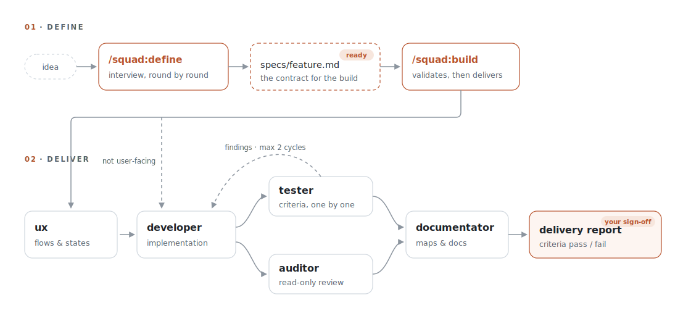

# claude-squad

> A five-role engineering team for Claude Code — UX, Developer, Tester, Auditor, and Documentator as coordinated subagents — with a conversational spec mode, human quality gates, a mechanical security policy, and pipelines that define, build, fix, refactor, and review.

[](LICENSE)
[](https://code.claude.com/docs/en/plugins)

## Why

A single AI session doing everything wears every hat at once: it implements, then grades its own work, then documents whatever it believes it did. Separated roles with hard boundaries produce better software — the implementer doesn't review itself, the reviewer can't quietly "fix" things, and tests defend the contract instead of the implementation.

**claude-squad** packages that discipline as a Claude Code plugin. Your main session orchestrates five specialized subagents; product definition deliberately isn't delegated — it's a conversation, so it runs in your own session (see [DESIGN.md](DESIGN.md)). Role boundaries are enforced by tooling, not by trust — the auditor has no write tools, the documentator has no shell, and a hook blocks dangerous operations outright.

## Features

- **`/squad:define <idea>`** — conversational spec mode: the session interviews you, round by round, until the definition closes — then writes a spec file with verifiable acceptance criteria.
- **`/squad:build <spec>`** — the delivery pipeline from a closed spec: UX → developer → tester ∥ auditor → documentator, with the spec's acceptance criteria as the tester's checklist.
- **`/squad:fix <bug>`** — reproduce-first bug fixing: the tester captures the bug as a failing test before the developer may touch code; it clarifies interactively when the report is informal or a screenshot, and ends with a sibling scan for the same defect elsewhere.
- **`/squad:refactor <target>`** — behavior-preserving restructuring: existing tests become the frozen invariant (identical results before and after), and the auditor judges whether the new structure is actually better.
- **`/squad:review <target>`** — read-only team review of a diff, branch, or PR: parallel security/contract/UX lenses, merged into a severity-ranked verdict.
- **Five roles, mechanically bounded** — each agent's toolset matches its mandate (see [The roles](#the-roles)); definition stays in your session because it's a conversation.
- **Parallel verification** — Tester and Auditor review the change simultaneously; findings loop back to the Developer for up to two fix cycles before escalating to you.
- **Security hook** — `kubectl`, `.env` files, and work-destroying git commands (`git reset --hard`, `git clean -f`, `git checkout -- .`, `git restore .`, `git push --force`, …) are blocked at the tool-call level in every session where the plugin is enabled, with a test suite pinning exactly what is allowed and denied.
- **Reusable playbooks** — semantic architecture (state/lifecycle/reuse changes), breaking changes (contracts, schemas, formats), and a smallest-sufficient-validation policy, preloaded into the roles that need them and invocable standalone.
- **Roles work standalone** — use the auditor for a one-off review or the tester to hunt flaky tests, without running a pipeline.

## How it works

<picture>
  <source media="(prefers-color-scheme: dark)" srcset="docs/pipeline-dark.svg">
  
</picture>

Definition is a conversation; delivery is a pipeline. `/squad:define` runs in your main session — the interview happens directly, no subagent relay — and ends when the spec closes with verifiable acceptance criteria and explicit out-of-scope. `/squad:build` takes that file as the contract: it refuses specs without verifiable criteria, the tester verifies each criterion one by one, and scope never changes mid-build — if implementation proves the spec wrong, the pipeline stops and sends you back to `define`. The delivery report covers each criterion pass/fail, files changed, test targets run with results, the audit verdict, and docs updated.

The dedicated pipelines (`fix`, `refactor`, `review`) follow the same philosophy — role boundaries, human gates, structured reports — each with a choreography suited to its job. For small, well-bounded tasks, `define` closes in a round or two and `build` does the rest.

## Requirements

- [Claude Code](https://code.claude.com) with plugin support
- Python 3 (for the security hook; preinstalled on macOS and most Linux distros)

## Installation

From GitHub:

```bash
claude plugin marketplace add sturlese/claude-squad
claude plugin install squad@claude-squad
```

Or from a local clone:

```bash
git clone https://github.com/sturlese/claude-squad.git
claude plugin marketplace add ./claude-squad
claude plugin install squad@claude-squad
```

Enable or disable per project (the full team is noise in small sandboxes):

```bash
claude plugin enable squad@claude-squad --scope project
claude plugin disable squad@claude-squad --scope project
```

## Usage

**Define, then build** — the main flow for real features:

```
/squad:define let users archive products they no longer sell
  # ...you chat: problem, scope in/out, acceptance criteria...
  # → specs/archive-products.md (status: ready)

/squad:build specs/archive-products.md
  # → ux → developer → tester ∥ auditor → documentator → report
```

Specs live in git: iterate one today, build it tomorrow — and the acceptance criteria you negotiated in the chat are exactly what the tester verifies at the end.

**Dedicated pipelines** for the other common jobs:

```
/squad:fix the CSV export drops rows containing commas
/squad:fix the export button does nothing (screenshot attached)
/squad:refactor extract the pricing logic scattered across checkout
/squad:review feature/csv-export
```

`fix` reproduces first — it refuses to patch anything until the bug exists as a failing test — and clarifies interactively in the main session when the report is informal or a screenshot; `refactor` freezes the tests as the invariant while structure improves; `review` changes nothing and returns a ranked verdict.

**Individual roles** — mention any agent directly:

```
use the squad:auditor agent to review this diff
@agent-squad:documentator map the payments module
```

**Skills standalone**:

```
/squad:semantic-architecture   # state/lifecycle/selector-reuse architecture rules
/squad:breaking-change         # contract/schema/format transition playbook
/squad:final-validation        # smallest-sufficient build/test/lint policy
```

You can talk to the orchestrator in any language; everything the team produces — code, docs, reports, commit messages — is always English.

## The roles

| Role | May write | Hard boundary |
|---|---|---|
| `ux` | Docs (`.md`) | No source code; returns instructions for the developer instead. |
| `developer` | Code | Must search for reusable code before writing; validates with the smallest sufficient targets at the end. |
| `tester` | Tests only | Never production code. A failing test is a risk signal, never something to "adapt" to the implementation. Runs test commands sequentially unless the project documents parallel-safe suites. |
| `auditor` | Nothing | No write tools at all; shell restricted to read-only inspection. Findings come back as severity-ranked fix instructions. |
| `documentator` | Docs | No shell — cannot run builds or tests by construction. Maintains per-directory `index.md` maps. |

## Security policy

`hooks/guard.py` runs as a `PreToolUse` hook in every session where the plugin is enabled (including all subagents) and blocks:

- `kubectl` / direct cluster access
- reading or writing `.env` files (`.env.example`, `.sample`, `.template`, `.test` are allowed)
- git commands that throw away uncommitted or shared work: `git reset --hard`, `git clean -f`, `git checkout -- .` / `git checkout .`, `git restore .`, `git stash clear` / `drop`, and `git push --force` (`--force-with-lease` is allowed)

It is a guardrail for a **cooperative** agent, not a sandbox against an adversary: it matches command invocations — including inside `$(…)`, behind `sudo`, and via full paths — and covers the same-intent siblings of each banned command, but it does not chase deliberate obfuscation. That is why the prose rules below and your own permission `deny` rules are the outer layers. Exactly what the hook allows and denies is pinned by `hooks/test_guard.py`.

Prompt-injection handling (instructions found in fetched data are ignored and reported), secret redaction, and ask-don't-touch rules for production systems are prose rules in every agent. Plugins cannot ship permission rules, so for defense in depth you can also add deny rules to a project's `.claude/settings.json`:

```json
{
  "permissions": {
    "deny": ["Read(**/.env)", "Read(**/.env.*)", "Bash(kubectl *)"]
  }
}
```

## Project conventions (optional)

The agents read whatever context a project offers — `CLAUDE.md`, `README.md`, architecture docs. Projects that additionally expose a system-overview command (like a `make info` target listing services, entry points, and build/test/lint commands) and per-directory `index.md` maps (what the module is for, what to reuse, what to avoid) get richer, more precise behavior from every role. Nothing is required — the documentator role can bootstrap those maps for you: ask it directly, e.g. `@agent-squad:documentator bootstrap per-directory index.md maps and a system overview` (pull in the auditor to flag security-sensitive areas).

## Composing with loops

Every pipeline has a clear stop condition and structured output, which makes them natural targets for Claude Code's loop primitives (`/loop`, `/goal`, `/schedule`):

```
/goal every acceptance criterion in specs/payments.md passes — run /squad:build, stop after 5 tries
/loop 1h /squad:review feature/csv-export     # re-review the branch each hour as it grows
/schedule every Monday at 9:00: /squad:review the changes merged to main last week
```

Unattended loops stall on permission prompts — configure your allowlists first, and keep the security hook's deny rules as the floor.

## Updating

The plugin cache is keyed by version, and both `install` and `marketplace update` are no-ops for an already-installed name. After changing the plugin, bump `version` in `.claude-plugin/plugin.json`, then:

```bash
claude plugin marketplace update claude-squad
claude plugin update squad@claude-squad   # restart the session to apply
```

## Customizing

Every role is a plain Markdown file in `agents/` — edit the prompts, tighten the tool lists, or add roles (a `security` specialist, a `data` engineer). Skills live in `skills/` (each pipeline is its own `skills/<name>/SKILL.md` — `build`, `fix`, `refactor`, …), and the hook in `hooks/guard.py`. Validate before committing:

```bash
claude plugin validate .          # official plugin schema check
python3 scripts/validate_plugin.py   # structural checks (frontmatter, skill refs, manifests)
python3 hooks/test_guard.py          # the security guard's allow/deny contract
```

## Roadmap

- Parallel solution variants: multiple developers in isolated worktrees, auditor as judge.
- Per-role model routing (e.g. documentator on a smaller model).
- Eval suite (`claude plugin eval`) for the role prompts.
- A `/squad:retro` skill that turns a bad run into reviewed patches to the role prompts, paired with new eval cases.

## Contributing

Issues and PRs are welcome. Keep role boundaries intact (no write tools for the auditor, no shell for the documentator), and bump the version on any behavior change. Before submitting, run the checks CI runs on every PR:

```bash
python3 -m py_compile hooks/guard.py
python3 hooks/test_guard.py          # guard allow/deny contract
python3 scripts/validate_plugin.py   # plugin structure
claude plugin validate .             # official schema check
```

## License

[MIT](LICENSE)
